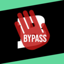

# Brainly Bypass

Uma extensão de navegador que remove o limite de visualização de respostas do [Brainly](https://brainly.com.br/) e remove anúncios visuais

## Instalação

- **Google Chrome:** Em Breve
- **Firefox:** https://addons.mozilla.org/pt-BR/firefox/addon/brainly-bypass/
- **Opera:** Em Breve
- **Edge:** Em Breve

> ⚠️ *Para publicar no Google Chrome, preciso pagar uma taxa de $5. Se quiser me ajudar, pode doar pelo meu [ko-fi](https://ko-fi.com/jackskelt/goal?g=0)*

### Instalação manual
Baixe o arquivo nas [releases](https://github.com/jackskelt/brainly-bypass/releases/latest) e instale manualmente no seu navegador